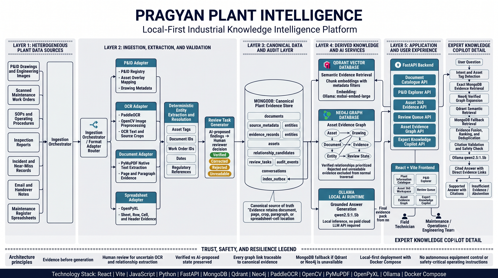
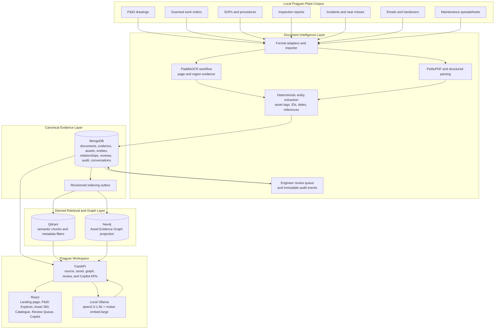

# AI for Industrial Knowledge Intelligence: Unified Asset & Operations Brain

### Pragyan Plant Intelligence



Pragyan Plant Intelligence is an AI-powered knowledge workspace built for the **ET AI Hackathon 2.0**. It brings fragmented plant information into one connected, inspectable experience: engineering drawings, work orders, SOPs, inspection reports, incidents, handovers, and structured maintenance records.

The product is built around a simple promise:

> Move from an asset tag or engineering question to evidence you can inspect, review, and trust.

## The Problem

Plant knowledge is rarely stored in one place. Engineers lose time moving between P&IDs, maintenance work orders, inspection records, procedures, incident reports, and handover communications. The result is not only slower information access; it makes it harder to understand the full evidence trail around an asset.

Pragyan turns those disconnected records into an **asset-centred knowledge layer**. It preserves source context, separates reviewed facts from uncertain extraction, and gives users a direct path from question to evidence.

## What Is Built

### Universal Document Intelligence

- Ingests the Pragyan prototype corpus across P&IDs, scanned maintenance work orders, SOPs, inspection reports, incident/near-miss records, emails/handover notes, and structured maintenance registers.
- Uses document parsing and OCR evidence with page, region, sheet, row, and cell traceability where available.
- Extracts industrial identifiers including asset tags, document IDs, work-order IDs, dates, and explicit regulatory references.
- Preserves uncertain extraction as reviewable evidence instead of silently treating it as fact.

### P&ID Explorer and Asset 360

- Displays Pragyan P&IDs with curated asset overlays.
- Opens an Asset 360 workspace for a selected tag, such as `ETP-601`.
- Connects drawing context, document evidence, reviewed relationships, proposed links, and audit history around an asset.
- Keeps verified evidence distinct from `AI proposed` extraction.

### Asset Evidence Graph

The **Asset Evidence Graph** is the visual evidence layer behind Asset 360. It connects:

- Assets and P&ID drawings
- Documents and source evidence chunks
- Extracted entities and linked asset mentions
- Review tasks and immutable audit events

Neo4j provides efficient graph traversal and visualisation, while MongoDB remains the canonical source of truth. Every displayed graph relationship must resolve back to source-backed evidence; graph connectivity is never presented as causation, a fault conclusion, or a compliance decision.

### Human-in-the-Loop Review

- Review uncertain OCR, entity, and relationship candidates.
- Verify, correct, reject, or mark evidence unreadable.
- Record decisions as immutable audit events.
- Ensure rejected and unreadable evidence does not enter ordinary retrieval.

### Expert Knowledge Copilot

The **Expert Knowledge Copilot** is a local, evidence-grounded RAG workflow for operational, maintenance, and engineering information discovery.

- Accepts natural-language questions with optional asset context.
- Uses exact asset/document matching, graph expansion, vector retrieval, and MongoDB fallback.
- Returns concise answers with direct citations and source navigation.
- Labels evidence support and review state rather than inventing certainty.
- Returns `Insufficient Evidence` when records do not support an answer.
- Enforces safety boundaries for plant-control requests, live values, setpoints, alarms, root-cause conclusions, predictions, and compliance determinations.

## Evaluation Alignment

| Hackathon evaluation focus | How Pragyan addresses it | Demo proof |
| --- | --- | --- |
| **Entity extraction accuracy** | Deterministic entity extraction plus source location and a review workflow for uncertain candidates. | Open a record, inspect extracted entities, and submit a review decision. |
| **Query answer quality** | Hybrid retrieval, evidence-only answer generation, citations, and abstention. | Ask the Copilot about `ETP-601`, open its evidence, then ask an unsupported question. |
| **Knowledge graph linkage** | Curated P&ID relationships and source-backed Asset Evidence Graph projection. | Select `ETP-601` from a P&ID and inspect linked evidence. |
| **Time to answer** | Asset-first navigation, grounded search, and retrieval metrics reduce the path from tag to source record. | Compare Asset 360 evidence discovery with manual document-by-document lookup. |
| **Cross-functional knowledge discovery** | Engineering, maintenance, inspection, incident, procedure, and handover context meet at the same asset. | Follow one asset from drawing to linked records and Copilot citations. |
| **Field usability** | Responsive operational pages, citation access, and mobile evidence patterns. | Open Asset 360 and the Copilot at a mobile viewport. |

> **Scope boundary:** This prototype focuses on trustworthy evidence discovery and engineering review. Automated compliance-gap detection, predictive maintenance, live plant integration, autonomous maintenance, and root-cause conclusions are deliberately not claimed.

## Architecture



### Trust Model

1. **MongoDB is canonical.** Documents, evidence, review decisions, and audit history are authoritative here.
2. **Qdrant is derived.** It accelerates semantic retrieval but does not own source truth.
3. **Neo4j is derived.** It accelerates evidence-graph traversal but does not decide whether a relationship is true.
4. **Ollama is constrained.** It receives a selected local evidence pack and must produce cited output or abstain.
5. **The engineer remains in control.** Uncertain evidence is routed to review rather than promoted automatically.

## Open-Source, Local-First Technology Stack

All plant data, OCR artifacts, vector embeddings, graph data, and Copilot processing stay on the local development machine.

| Layer | Technology | Role |
| --- | --- | --- |
| Frontend | React, Vite, JavaScript | Responsive landing page and operational workspace |
| UI | Vanilla CSS, Lucide, React Query, React Router, React Flow | Design system, navigation, data fetching, and graph visualisation |
| Backend | Python, FastAPI, Uvicorn | Versioned APIs, ingestion, evidence, review, graph, and Copilot services |
| Canonical database | MongoDB Community Edition | Documents, source evidence, assets, entities, review state, audits, and conversations |
| Vector database | Qdrant | Local metadata-filtered semantic retrieval |
| Graph database | Neo4j Community | Local Asset Evidence Graph projection and traversal |
| OCR | PaddleOCR, OpenCV | Scanned work-order text, regions, and extraction confidence |
| Document parsing | PyMuPDF, OpenPyXL | PDF text/page extraction and structured spreadsheet ingestion |
| Local LLM runtime | Ollama | Runs models locally without a cloud API key |
| Chat model | `qwen2.5:1.5b` | Concise evidence-grounded answer generation |
| Embedding model | `mxbai-embed-large` | Local vector embeddings for Qdrant |
| Local infrastructure | Docker Compose | Starts Qdrant and Neo4j with persistent volumes |
| Testing | Pytest, Vitest, Testing Library | Backend, frontend, and workflow regression coverage |

## Key User Journeys

### 1. P&ID to Asset Evidence

1. Open **P&ID Explorer**.
2. Select `ETP-601` from the Effluent Treatment Plant drawing.
3. Open **Asset 360** to inspect connected relationships and evidence.
4. Follow a document or graph connection to its direct source context.

### 2. Review Uncertain Extraction

1. Open **Review Queue**.
2. Inspect an OCR crop or extracted relationship candidate.
3. Verify, correct, reject, or mark it unreadable.
4. View the decision in the asset audit timeline.

### 3. Ask the Copilot

1. Open **Copilot** with an asset selected, or ask a question directly.
2. Review the concise answer and evidence-support label.
3. Open a citation to inspect the source record.
4. When evidence is absent or the request is unsafe, receive a clear boundary instead of a fabricated response.

## Run Locally

### Prerequisites

- Windows with Node.js 18+ and Python 3.10+
- MongoDB Community Edition running locally
- Docker Desktop
- Ollama

### 1. Start local vector and graph services

```powershell
docker compose -f infra/rag-compose.yml up -d
```

### 2. Prepare local Ollama models

```powershell
ollama pull qwen2.5:1.5b
ollama pull mxbai-embed-large
```

### 3. Configure and start the backend

Create `backend/.env` from `backend/.env.example`, then set local MongoDB and Neo4j credentials as needed.

```powershell
cd backend
.\.venv-api\Scripts\Activate.ps1
pip install -r requirements.txt
python -m uvicorn app.main:app --reload --port 8000
```

Backend health: [http://localhost:8000/api/v1/health](http://localhost:8000/api/v1/health)

### 4. Start the frontend

```powershell
cd frontend
npm install
npm run dev
```

Open [http://localhost:5173](http://localhost:5173).

| Route | Experience |
| --- | --- |
| `/` | Public landing page |
| `/overview` | Operational workspace overview |
| `/drawings` | P&ID Explorer |
| `/assets/ETP-601` | Asset 360 lead demo |
| `/catalogue` | Plant Information Catalogue |
| `/review` | Review Queue |
| `/copilot` | Expert Knowledge Copilot |

## Validation

```powershell
cd backend
.\.venv-api\Scripts\pytest.exe

cd ..\frontend
npm run test
npm run build
npm run lint
```

## Project Structure

```text
backend/        FastAPI APIs, adapters, OCR, entity extraction, retrieval, graph, review services
frontend/       React landing page and operational workspace
Data/           Pragyan P&IDs, documents, manifests, OCR artifacts, fixtures, and evaluation data
infra/          Local Qdrant and Neo4j Docker Compose configuration
design-system/  Landing-page design-system reference
*.md            Product, architecture, safety, delivery, RAG, and implementation documentation
```

## Safety and Responsible AI

Pragyan is built to be useful without pretending to be autonomous. It does not issue plant-control instructions, valve movements, setpoints, alarm acknowledgements, emergency procedures, live process values, predictive-maintenance actions, compliance determinations, or root-cause conclusions.

When evidence is missing, weak, rejected, or outside the product boundary, the system should return an evidence-limited response rather than inventing an answer.

---

Built for the **ET AI Hackathon 2.0**: industrial knowledge that engineers can trace, review, and use.
